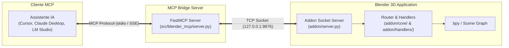

<div align="center">

# 🧊 Blender MCP

**Model Context Protocol (MCP) Server & Addon para Integração do Blender 3D com Modelos de Linguagem (LLMs)**

[](https://www.python.org/downloads/)
[](https://www.blender.org/)
[](LICENSE)
[](https://modelcontextprotocol.io/)

Permite que assistentes de IA (Claude Desktop, Cursor, LM Studio, Continue, Ollama e clientes MCP personalizados) controlem e automatizem fluxos de trabalho no Blender 3D em tempo real através do **Model Context Protocol (MCP)**.

[Funcionalidades](#-funcionalidades) • [Arquitetura](#-arquitetura) • [Instalação](#-instalação--configuração) • [Clientes MCP](#-configuração-de-clientes-mcp) • [Segurança](#-segurança) • [Documentação](#-documentação-técnica)

</div>

---

## 🚀 Funcionalidades

- **Controle Espacial Completo**: Criação, modificação, transformação, rotação, escala e deleção de objetos 3D no Blender.
- **Engenharia e Impressão 3D**:
  - Geração paramétrica de fixadores mecânicos (parafusos ISO, porcas, arruelas, furos roscados).
  - Análise estrutural, cálculo de volume, centro de massa e área de superfície.
  - Verificação de espessura de paredes finas e análise de overhangs para manufatura aditiva.
  - Reparo automático de malhas não-estanches (non-manifold) e geração de cascas estanques.
- **Materiais e Shading**:
  - Suporte completo a shaders procedurais e redes de nós (Principled BSDF).
  - Integração com provedores de PBR: **Poly Haven**, **AmbientCG** e **Sketchfab**.
- **Automação de Estúdio e Render**:
  - Configuração automática de estúdio para fotografia de produtos (ciclorama, iluminação de 3 pontos, softboxes).
  - Captura e inspeção de viewport em tempo real com feedback multimodal para o modelo.
- **Barra de Status Integrada**:
  - Indicador de status compacto e elegante no rodapé do Blender com ação de alternância rápida (Start / Stop com um clique).
- **Servidor WebUI Embutido**:
  - Visualizador 3D em tempo real via browser para inspeção remota da cena.
- **Execução Segura de Código**:
  - Sandbox de execução com circuit breaker, timeout configurável, rate limiting e tokens de autenticação.

---

## 🏛 Arquitetura

O sistema é composto por duas partes sincronizadas via socket TCP de baixa latência:



1. **Blender Addon (`addon/`)**:
   - Roda internamente no processo do Blender.
   - Escuta comandos JSON em porta TCP local (padrão: `9876`).
   - Roteia as operações para a thread principal do Blender via `bpy.app.timers`.
2. **MCP Server (`src/blender_mcp/`)**:
   - Implementa a especificação oficial do Model Context Protocol (FastMCP).
   - Traduz tool calls de IA em comandos estruturados para o addon no Blender.

---

## 📦 Instalação & Configuração

### Pré-requisitos
- **Blender 4.2 LTS** ou superior (compatível com o sistema moderno de Extensões).
- **Python 3.10+**.
- **[uv](https://docs.astral.sh/uv/)** (gerenciador de ambiente e pacotes ultra-rápido).

### 1. Clonar o Repositório

```bash
git clone https://github.com/yuri-schmaltz/mcp_blender.git
cd mcp_blender
```

### 2. Sincronizar Dependências com `uv`

```bash
uv sync --extra gui --extra test
```

### 3. Instalar o Addon no Blender

1. No Blender, abra **Edit > Preferences > Add-ons**.
2. Clique no menu superior direito (ícone de engrenagem) e selecione **Install from Disk...**.
3. Selecione o arquivo [`addon.py`](addon.py) ou instale como extensão apontando para a pasta raiz do repositório.
4. Habilite o addon **Blender MCP**.
5. Na barra de status inferior (ou no painel lateral `3D View > Sidebar > MCP`), clique no ícone/botão **Start Server**.

---

## 🤖 Configuração de Clientes MCP

### Cursor

Adicione a configuração em `.cursor/mcp.json` ou nas configurações globais:

```json
{
  "mcpServers": {
    "blender": {
      "command": "uv",
      "args": ["run", "blender-mcp"],
      "cwd": "/caminho/absoluto/para/mcp_blender"
    }
  }
}
```

### Claude Desktop

Edite o arquivo `claude_desktop_config.json`:
- **macOS**: `~/Library/Application Support/Claude/claude_desktop_config.json`
- **Windows**: `%APPDATA%\Claude\claude_desktop_config.json`
- **Linux**: `~/.config/Claude/claude_desktop_config.json`

```json
{
  "mcpServers": {
    "blender": {
      "command": "uv",
      "args": ["run", "blender-mcp"],
      "cwd": "/caminho/absoluto/para/mcp_blender"
    }
  }
}
```

### LM Studio

1. Abra **Settings → Developer → Model Context Protocol (MCP)**.
2. Adicione um novo servidor:
   - **Command:** `uv`
   - **Arguments:** `run blender-mcp`
   - **Working Directory:** Diretório raiz do projeto.

---

## ⚙️ Variáveis de Ambiente & Configuração

| Variável | Padrão | Descrição |
| :--- | :--- | :--- |
| `BLENDER_HOST` | `127.0.0.1` | Endereço do socket do Blender |
| `BLENDER_PORT` | `9876` | Porta do socket TCP |
| `BLENDER_MCP_TOKEN` | *(vazio)* | Token de autenticação opcional para transporte seguro |
| `BLENDER_MCP_LOG_LEVEL` | `INFO` | Nível de log (`DEBUG`, `INFO`, `WARNING`, `ERROR`) |
| `BLENDER_MCP_LOG_HANDLER` | `console` | Destino do log (`console` ou `file`) |
| `BLENDER_MCP_CODE_TIMEOUT`| `30.0` | Timeout em segundos para execução de scripts arbitrários |
| `BLENDER_MCP_MAX_PAYLOAD` | `4194304` | Tamanho máximo de payload recebido via TCP (4 MiB) |

---

## 🛡️ Segurança

Consulte [SECURITY.md](SECURITY.md) para a política detalhada de segurança e o modelo de ameaças.
- **Isolamento de Loopback**: Por padrão, o servidor recusa conexões com bind público (`0.0.0.0`).
- **Circuit Breaker**: Proteção contra saturação de chamadas ou travamentos no loop de eventos do Blender.
- **Cap de Payload**: Bloqueia payloads gigantescos que possam causar saturação de memória.

---

## 🧪 Testes de Qualidade

O projeto possui uma suíte de testes unitários e de integração abrangente:

```bash
# Executar a suíte de testes principal (185+ testes)
uv run pytest -m "not visual"

# Executar testes unitários específicos
uv run pytest tests/unit/test_statusbar.py -v
```

---

## 📚 Documentação Técnica

- [Arquitetura do Sistema](docs/ARCHITECTURE.md)
- [Decisões Arquiteturais (ADRs)](docs/ADR-0001-modular-structure.md)
- [Design System & Interface](docs/DESIGN_SYSTEM.md)
- [Runbook Operacional](docs/RUNBOOK.md)
- [Guia de Troubleshooting](docs/TROUBLESHOOTING.md)
- [Guia de Contribuição](CONTRIBUTING.md)

---

## 📄 Licença & Autoria

Distribuído sob a licença **MIT**. Veja [`LICENSE`](LICENSE) para mais informações.

- **Mantenedor & Desenvolvedor Principal**: [Yuri Schmaltz](https://github.com/yuri-schmaltz)
